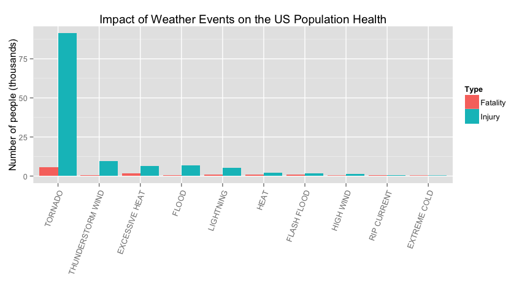
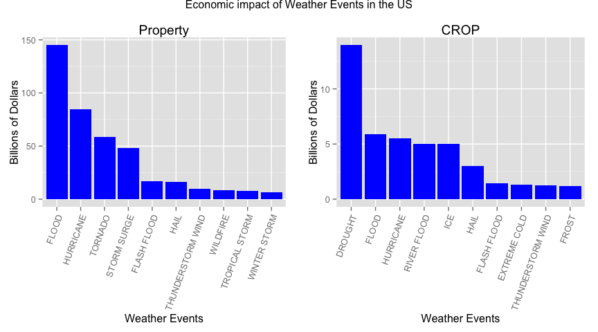
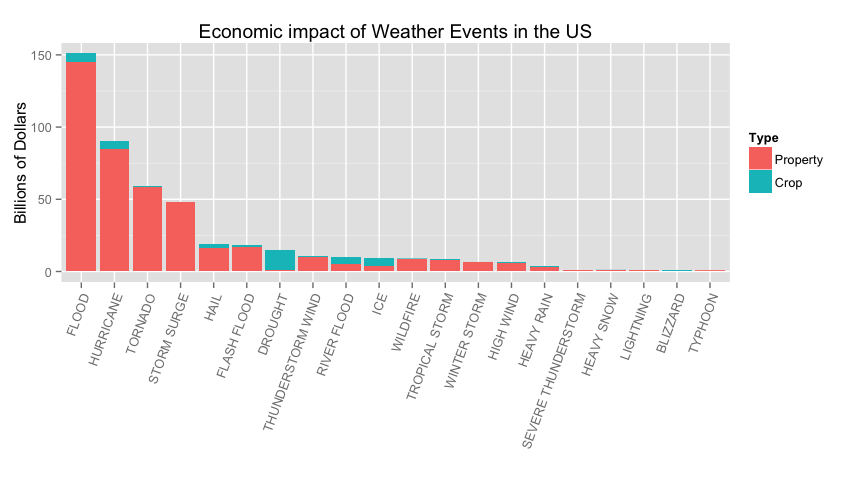

# Weather Events impact on People Health and Economics in the US
Carlos Correia  
23 November 2014  

## Synopsis


## Data Processing

### Loading Libraries and defining global variables

```r
library(dplyr)
```

```
## 
## Attaching package: 'dplyr'
## 
## The following object is masked from 'package:stats':
## 
##     filter
## 
## The following objects are masked from 'package:base':
## 
##     intersect, setdiff, setequal, union
```

```r
library(reshape2)
library(ggplot2)
library(grid)
library(gridExtra)

fileURL      <- "https://d396qusza40orc.cloudfront.net/repdata%2Fdata%2FStormData.csv.bz2"
localZipFile <- "./data/storm_data.csv.bz2"
inputRmdFile <- "PA2.Rmd"
```

### Helper functions

```r
## Download and Extract Zip data file
downloadAndExtractZipFile <- function(fileName){
  ## check if the data folder exists
  if(!file.exists("data")){
    dir.create("data")
  }
    
  ## check if zip file exists - if not download the zip file with the data
  if(!file.exists(fileName)){
    download.file(fileURL, destfile = fileName, method = "curl")
  }
}

## Reads the CSV data file
readCSVFile <- function(fileName, ...){
  if(! file.exists(fileName)){
    stop(paste("readDataFile: File ", fileName, " doesn't exist"))
  }
  
  print(paste("Reading file ", fileName))
  read.csv(fileName, ...)
}

## Cleanup and normalize the EVTYPE
cleanupEVTYPE <- function(input){
  output <- input %>%
    toupper() %>%
    gsub(pattern = "^\\t+", replacement = "", perl = TRUE) %>%
    gsub(pattern = "^\\s+", replacement = "", perl = TRUE) %>%
    gsub(pattern = "^AVALANCE.+", replacement = "AVALANCHE", perl = TRUE) %>%
    gsub(pattern = "^BLIZZARD.+", replacement = "BLIZZARD", perl = TRUE) %>%
    gsub(pattern = "^COASTAL FLOOD.+", replacement = "COASTAL FLOOD", perl = TRUE) %>%
    gsub(pattern = "^COASTAL  FLOODING/EROSION$", replacement = "COASTAL FLOOD", perl = TRUE) %>%
    gsub(pattern = "^COASTALSTORM", replacement = "COASTAL STORM", perl = TRUE) %>%
    gsub(pattern = "^COLD.+", replacement = "COLD", perl = TRUE) %>%
    gsub(pattern = "^COOL AND WET$", replacement = "COLD", perl = TRUE) %>%
    gsub(pattern = "^DROUGHT.+", replacement = "DROUGHT", perl = TRUE) %>%
    gsub(pattern = "^DRY MIRCOBURST WINDS$", replacement = "DRY MIRCOBURST", perl = TRUE) %>%
    gsub(pattern = "^DUST DEVIL.+", replacement = "DUST DEVIL", perl = TRUE) %>%
    gsub(pattern = "^DUST STORM.+", replacement = "DUST STORM", perl = TRUE) %>%
    gsub(pattern = "^EXTREME COLD.+", replacement = "EXTREME COLD", perl = TRUE) %>%
    gsub(pattern = "^EXTREME WIND CHILL$", replacement = "EXTREME WINDCHILL", perl = TRUE) %>%
    gsub(pattern = "^FLASH FLOOD.+", replacement = "FLASH FLOOD", perl = TRUE) %>%
    gsub(pattern = "^FREEZE.+", replacement = "FREEZE", perl = TRUE) %>%
    gsub(pattern = "^FREEZING.+", replacement = "FREEZE", perl = TRUE) %>%
    gsub(pattern = "^GUSTY WIND", replacement = "GUSTY WINDS", perl = TRUE) %>%
    gsub(pattern = "^HEAT WAVE.+", replacement = "HEAT WAVE", perl = TRUE) %>%
    gsub(pattern = "^HEAVY RAIN.+", replacement = "HEAVY RAIN", perl = TRUE) %>%
    gsub(pattern = "^HEAVY SNOW.+", replacement = "HEAVY SNOW", perl = TRUE) %>%
    gsub(pattern = "^FLOOD.+", replacement = "FLOOD", perl = TRUE) %>%
    gsub(pattern = "^RIVER FLOOD.+", replacement = "FLOOD", perl = TRUE) %>%
    gsub(pattern = "^FREEZE.+", replacement = "FREEZE", perl = TRUE) %>%
    gsub(pattern = "^FROST.+", replacement = "FROST", perl = TRUE) %>%
    gsub(pattern = "^GUSTY WINDS.+", replacement = "GUSTY WINDS", perl = TRUE) %>%
    gsub(pattern = "^HAIL.+", replacement = "HAIL", perl = TRUE) %>%
    gsub(pattern = "^HEAVY SURF.+", replacement = "HEAVY SURF", perl = TRUE) %>%
    gsub(pattern = "^HIGH SURF.+", replacement = "HIGH SURF", perl = TRUE) %>%
    gsub(pattern = "^HIGH WIND.+", replacement = "HIGH WIND", perl = TRUE) %>%
    gsub(pattern = "^HIGH$", replacement = "HIGH WIND", perl = TRUE) %>% ## see REMARKS
    gsub(pattern = "^HURRICANE.+", replacement = "HURRICANE", perl = TRUE) %>%
    gsub(pattern = "^HYPOTHERMIA.+", replacement = "HYPOTHERMIA", perl = TRUE) %>%
    gsub(pattern = "^ICE.+", replacement = "ICE", perl = TRUE) %>%
    gsub(pattern = "^ICY ROADS.+", replacement = "ICE", perl = TRUE) %>%
    gsub(pattern = "^LANDSLIDE.+", replacement = "LANDSLIDE", perl = TRUE) %>%
    gsub(pattern = "^LIGHTNING.+", replacement = "LIGHTNING", perl = TRUE) %>%
    gsub(pattern = "^RECORD/EXCESSIVE HEAT$", replacement = "RECORD HEAT", perl = TRUE) %>%
    gsub(pattern = "^RIP CURRENT.+", replacement = "RIP CURRENT", perl = TRUE) %>%
    gsub(pattern = "^SNOW.+", replacement = "SNOW", perl = TRUE) %>%
    gsub(pattern = "^STORM SURGE.+", replacement = "STORM SURGE", perl = TRUE) %>%
    gsub(pattern = "^STRONG WIND.+", replacement = "STRONG WIND", perl = TRUE) %>%
    gsub(pattern = "^THUNDERSTORM.*", replacement = "THUNDERSTORM WIND", perl = TRUE) %>%
    gsub(pattern = "^THUNDERTORM WINDS$", replacement = "THUNDERSTORM WIND", perl = TRUE) %>%
    gsub(pattern = "^TSTM WIND.*", replacement = "THUNDERSTORM WIND", perl = TRUE) %>%
    gsub(pattern = "^TORNADO.+", replacement = "TORNADO", perl = TRUE) %>%
    gsub(pattern = "^TROPICAL STORM.+", replacement = "TROPICAL STORM", perl = TRUE) %>%
    gsub(pattern = "^UNSEASONABLY WARM.+", replacement = "UNSEASONABLY WARM", perl = TRUE) %>%
    gsub(pattern = "^URBAN FLOOD.+", replacement = "URBAN/SML STREAM FLD", perl = TRUE) %>%
    gsub(pattern = "^URBAN SMALL.*", replacement = "URBAN/SML STREAM FLD", perl = TRUE) %>%
    gsub(pattern = "^URBAN/SMALL STREAM.*", replacement = "URBAN/SML STREAM FLD", perl = TRUE) %>%
    gsub(pattern = "^URBAN AND SMALL STREAM FLOODIN$", 
         replacement = "URBAN/SML STREAM FLD", perl = TRUE) %>%
    gsub(pattern = "^WATERSPOUT.+", replacement = "WATERSPOUT", perl = TRUE) %>%
    gsub(pattern = "^WILD.+", replacement = "WILDFIRE", perl = TRUE) %>%
    gsub(pattern = "^WIND.+", replacement = "WIND", perl = TRUE) %>%
    gsub(pattern = "^WINTER STORM.+", replacement = "WINTER STORM", perl = TRUE) %>%
    gsub(pattern = "^WINTER WEATHER.+", replacement = "WINTER WEATHER", perl = TRUE)
  
  output
}

## Calculates the DMG values by checking the EXP and update the DMG value
calculateDMG <- function(value, exp){
  output <- value
  
  if(as.numeric(value) > 0 && !is.null(exp)) {
    output <- switch(EXPR = as.character(exp),
           B =, b = value * 1000000000,
           M =, m = value * 1000000,
           K =, k = value * 1000,
           H =, h = value * 100,
           "+" =, "-" = value,
           "0" =, "2" =,"3" =, "6" =, "7" = value * 10 + as.numeric(exp), #Zero id 26267
           "5" = (value * 10 +5 ) * 1000,     ## see remarks 135k for ID 49238
           "4" = value * 1000000, ## see remark for ID 37895 (2.2M damages)
           value)
  }

  output
}
```

### Load Raw Data

```r
downloadAndExtractZipFile(localZipFile)

data <- readCSVFile(localZipFile)
```

```
## [1] "Reading file  ./data/storm_data.csv.bz2"
```

### Quick Data Summary

```r
str(data)
```

```
## 'data.frame':	902297 obs. of  37 variables:
##  $ STATE__   : num  1 1 1 1 1 1 1 1 1 1 ...
##  $ BGN_DATE  : Factor w/ 16335 levels "1/1/1966 0:00:00",..: 6523 6523 4242 11116 2224 2224 2260 383 3980 3980 ...
##  $ BGN_TIME  : Factor w/ 3608 levels "00:00:00 AM",..: 272 287 2705 1683 2584 3186 242 1683 3186 3186 ...
##  $ TIME_ZONE : Factor w/ 22 levels "ADT","AKS","AST",..: 7 7 7 7 7 7 7 7 7 7 ...
##  $ COUNTY    : num  97 3 57 89 43 77 9 123 125 57 ...
##  $ COUNTYNAME: Factor w/ 29601 levels "","5NM E OF MACKINAC BRIDGE TO PRESQUE ISLE LT MI",..: 13513 1873 4598 10592 4372 10094 1973 23873 24418 4598 ...
##  $ STATE     : Factor w/ 72 levels "AK","AL","AM",..: 2 2 2 2 2 2 2 2 2 2 ...
##  $ EVTYPE    : Factor w/ 985 levels "   HIGH SURF ADVISORY",..: 834 834 834 834 834 834 834 834 834 834 ...
##  $ BGN_RANGE : num  0 0 0 0 0 0 0 0 0 0 ...
##  $ BGN_AZI   : Factor w/ 35 levels "","  N"," NW",..: 1 1 1 1 1 1 1 1 1 1 ...
##  $ BGN_LOCATI: Factor w/ 54429 levels ""," Christiansburg",..: 1 1 1 1 1 1 1 1 1 1 ...
##  $ END_DATE  : Factor w/ 6663 levels "","1/1/1993 0:00:00",..: 1 1 1 1 1 1 1 1 1 1 ...
##  $ END_TIME  : Factor w/ 3647 levels ""," 0900CST",..: 1 1 1 1 1 1 1 1 1 1 ...
##  $ COUNTY_END: num  0 0 0 0 0 0 0 0 0 0 ...
##  $ COUNTYENDN: logi  NA NA NA NA NA NA ...
##  $ END_RANGE : num  0 0 0 0 0 0 0 0 0 0 ...
##  $ END_AZI   : Factor w/ 24 levels "","E","ENE","ESE",..: 1 1 1 1 1 1 1 1 1 1 ...
##  $ END_LOCATI: Factor w/ 34506 levels ""," CANTON"," TULIA",..: 1 1 1 1 1 1 1 1 1 1 ...
##  $ LENGTH    : num  14 2 0.1 0 0 1.5 1.5 0 3.3 2.3 ...
##  $ WIDTH     : num  100 150 123 100 150 177 33 33 100 100 ...
##  $ F         : int  3 2 2 2 2 2 2 1 3 3 ...
##  $ MAG       : num  0 0 0 0 0 0 0 0 0 0 ...
##  $ FATALITIES: num  0 0 0 0 0 0 0 0 1 0 ...
##  $ INJURIES  : num  15 0 2 2 2 6 1 0 14 0 ...
##  $ PROPDMG   : num  25 2.5 25 2.5 2.5 2.5 2.5 2.5 25 25 ...
##  $ PROPDMGEXP: Factor w/ 19 levels "","-","?","+",..: 17 17 17 17 17 17 17 17 17 17 ...
##  $ CROPDMG   : num  0 0 0 0 0 0 0 0 0 0 ...
##  $ CROPDMGEXP: Factor w/ 9 levels "","?","0","2",..: 1 1 1 1 1 1 1 1 1 1 ...
##  $ WFO       : Factor w/ 542 levels ""," CI","%SD",..: 1 1 1 1 1 1 1 1 1 1 ...
##  $ STATEOFFIC: Factor w/ 250 levels "","ALABAMA, Central",..: 1 1 1 1 1 1 1 1 1 1 ...
##  $ ZONENAMES : Factor w/ 25112 levels "","                                                                                                                               "| __truncated__,..: 1 1 1 1 1 1 1 1 1 1 ...
##  $ LATITUDE  : num  3040 3042 3340 3458 3412 ...
##  $ LONGITUDE : num  8812 8755 8742 8626 8642 ...
##  $ LATITUDE_E: num  3051 0 0 0 0 ...
##  $ LONGITUDE_: num  8806 0 0 0 0 ...
##  $ REMARKS   : Factor w/ 436781 levels "","\t","\t\t",..: 1 1 1 1 1 1 1 1 1 1 ...
##  $ REFNUM    : num  1 2 3 4 5 6 7 8 9 10 ...
```

```r
summary(data)
```

```
##     STATE__                  BGN_DATE             BGN_TIME     
##  Min.   : 1.0   5/25/2011 0:00:00:  1202   12:00:00 AM: 10163  
##  1st Qu.:19.0   4/27/2011 0:00:00:  1193   06:00:00 PM:  7350  
##  Median :30.0   6/9/2011 0:00:00 :  1030   04:00:00 PM:  7261  
##  Mean   :31.2   5/30/2004 0:00:00:  1016   05:00:00 PM:  6891  
##  3rd Qu.:45.0   4/4/2011 0:00:00 :  1009   12:00:00 PM:  6703  
##  Max.   :95.0   4/2/2006 0:00:00 :   981   03:00:00 PM:  6700  
##                 (Other)          :895866   (Other)    :857229  
##    TIME_ZONE          COUNTY           COUNTYNAME         STATE       
##  CST    :547493   Min.   :  0.0   JEFFERSON :  7840   TX     : 83728  
##  EST    :245558   1st Qu.: 31.0   WASHINGTON:  7603   KS     : 53440  
##  MST    : 68390   Median : 75.0   JACKSON   :  6660   OK     : 46802  
##  PST    : 28302   Mean   :100.6   FRANKLIN  :  6256   MO     : 35648  
##  AST    :  6360   3rd Qu.:131.0   LINCOLN   :  5937   IA     : 31069  
##  HST    :  2563   Max.   :873.0   MADISON   :  5632   NE     : 30271  
##  (Other):  3631                   (Other)   :862369   (Other):621339  
##                EVTYPE         BGN_RANGE           BGN_AZI      
##  HAIL             :288661   Min.   :   0.000          :547332  
##  TSTM WIND        :219940   1st Qu.:   0.000   N      : 86752  
##  THUNDERSTORM WIND: 82563   Median :   0.000   W      : 38446  
##  TORNADO          : 60652   Mean   :   1.484   S      : 37558  
##  FLASH FLOOD      : 54277   3rd Qu.:   1.000   E      : 33178  
##  FLOOD            : 25326   Max.   :3749.000   NW     : 24041  
##  (Other)          :170878                      (Other):134990  
##          BGN_LOCATI                  END_DATE             END_TIME     
##               :287743                    :243411              :238978  
##  COUNTYWIDE   : 19680   4/27/2011 0:00:00:  1214   06:00:00 PM:  9802  
##  Countywide   :   993   5/25/2011 0:00:00:  1196   05:00:00 PM:  8314  
##  SPRINGFIELD  :   843   6/9/2011 0:00:00 :  1021   04:00:00 PM:  8104  
##  SOUTH PORTION:   810   4/4/2011 0:00:00 :  1007   12:00:00 PM:  7483  
##  NORTH PORTION:   784   5/30/2004 0:00:00:   998   11:59:00 PM:  7184  
##  (Other)      :591444   (Other)          :653450   (Other)    :622432  
##    COUNTY_END COUNTYENDN       END_RANGE           END_AZI      
##  Min.   :0    Mode:logical   Min.   :  0.0000          :724837  
##  1st Qu.:0    NA's:902297    1st Qu.:  0.0000   N      : 28082  
##  Median :0                   Median :  0.0000   S      : 22510  
##  Mean   :0                   Mean   :  0.9862   W      : 20119  
##  3rd Qu.:0                   3rd Qu.:  0.0000   E      : 20047  
##  Max.   :0                   Max.   :925.0000   NE     : 14606  
##                                                 (Other): 72096  
##            END_LOCATI         LENGTH              WIDTH         
##                 :499225   Min.   :   0.0000   Min.   :   0.000  
##  COUNTYWIDE     : 19731   1st Qu.:   0.0000   1st Qu.:   0.000  
##  SOUTH PORTION  :   833   Median :   0.0000   Median :   0.000  
##  NORTH PORTION  :   780   Mean   :   0.2301   Mean   :   7.503  
##  CENTRAL PORTION:   617   3rd Qu.:   0.0000   3rd Qu.:   0.000  
##  SPRINGFIELD    :   575   Max.   :2315.0000   Max.   :4400.000  
##  (Other)        :380536                                         
##        F               MAG            FATALITIES          INJURIES        
##  Min.   :0.0      Min.   :    0.0   Min.   :  0.0000   Min.   :   0.0000  
##  1st Qu.:0.0      1st Qu.:    0.0   1st Qu.:  0.0000   1st Qu.:   0.0000  
##  Median :1.0      Median :   50.0   Median :  0.0000   Median :   0.0000  
##  Mean   :0.9      Mean   :   46.9   Mean   :  0.0168   Mean   :   0.1557  
##  3rd Qu.:1.0      3rd Qu.:   75.0   3rd Qu.:  0.0000   3rd Qu.:   0.0000  
##  Max.   :5.0      Max.   :22000.0   Max.   :583.0000   Max.   :1700.0000  
##  NA's   :843563                                                           
##     PROPDMG          PROPDMGEXP        CROPDMG          CROPDMGEXP    
##  Min.   :   0.00          :465934   Min.   :  0.000          :618413  
##  1st Qu.:   0.00   K      :424665   1st Qu.:  0.000   K      :281832  
##  Median :   0.00   M      : 11330   Median :  0.000   M      :  1994  
##  Mean   :  12.06   0      :   216   Mean   :  1.527   k      :    21  
##  3rd Qu.:   0.50   B      :    40   3rd Qu.:  0.000   0      :    19  
##  Max.   :5000.00   5      :    28   Max.   :990.000   B      :     9  
##                    (Other):    84                     (Other):     9  
##       WFO                                       STATEOFFIC    
##         :142069                                      :248769  
##  OUN    : 17393   TEXAS, North                       : 12193  
##  JAN    : 13889   ARKANSAS, Central and North Central: 11738  
##  LWX    : 13174   IOWA, Central                      : 11345  
##  PHI    : 12551   KANSAS, Southwest                  : 11212  
##  TSA    : 12483   GEORGIA, North and Central         : 11120  
##  (Other):690738   (Other)                            :595920  
##                                                                                                                                                                                                     ZONENAMES     
##                                                                                                                                                                                                          :594029  
##                                                                                                                                                                                                          :205988  
##  GREATER RENO / CARSON CITY / M - GREATER RENO / CARSON CITY / M                                                                                                                                         :   639  
##  GREATER LAKE TAHOE AREA - GREATER LAKE TAHOE AREA                                                                                                                                                       :   592  
##  JEFFERSON - JEFFERSON                                                                                                                                                                                   :   303  
##  MADISON - MADISON                                                                                                                                                                                       :   302  
##  (Other)                                                                                                                                                                                                 :100444  
##     LATITUDE      LONGITUDE        LATITUDE_E     LONGITUDE_    
##  Min.   :   0   Min.   :-14451   Min.   :   0   Min.   :-14455  
##  1st Qu.:2802   1st Qu.:  7247   1st Qu.:   0   1st Qu.:     0  
##  Median :3540   Median :  8707   Median :   0   Median :     0  
##  Mean   :2875   Mean   :  6940   Mean   :1452   Mean   :  3509  
##  3rd Qu.:4019   3rd Qu.:  9605   3rd Qu.:3549   3rd Qu.:  8735  
##  Max.   :9706   Max.   : 17124   Max.   :9706   Max.   :106220  
##  NA's   :47                      NA's   :40                     
##                                            REMARKS           REFNUM      
##                                                :287433   Min.   :     1  
##                                                : 24013   1st Qu.:225575  
##  Trees down.\n                                 :  1110   Median :451149  
##  Several trees were blown down.\n              :   568   Mean   :451149  
##  Trees were downed.\n                          :   446   3rd Qu.:676723  
##  Large trees and power lines were blown down.\n:   432   Max.   :902297  
##  (Other)                                       :588295
```

### Tidy Data
#### Cleanup data for the most harmful Storm Event Type

```r
## From the RawData we remove the rows that don't have injuries and fatalities, then select the columns EVTYPE, FATALITIES and INJURIES to have a reduced data set. After that we cleanup the EVTYPE column, group by the EVTYPE and calculate the the total FATALITIES and INJURIES per EVTYPE. Then we sort descendent the FATALITIES & INJURIES and pick the TOP 20
### MELT??????
tidyDataHarmful <- data[!(data$FATALITIES == 0 & data$INJURIES == 0), ] %>%
  select(EVTYPE, FATALITIES, INJURIES) %>%
  mutate(EVTYPE = cleanupEVTYPE(EVTYPE)) %>%
  group_by(EVTYPE) %>%
  summarise(Fatality = sum(FATALITIES), Injury = sum(INJURIES)) %>%
  arrange(desc(Fatality), desc(Injury)) %>%
  head(n = 10) %>%
  melt(id = c("EVTYPE"), variable.name = "Type")

str(tidyDataHarmful)
```

```
## 'data.frame':	20 obs. of  3 variables:
##  $ EVTYPE: chr  "TORNADO" "EXCESSIVE HEAT" "FLASH FLOOD" "HEAT" ...
##  $ Type  : Factor w/ 2 levels "Fatality","Injury": 1 1 1 1 1 1 1 1 1 1 ...
##  $ value : num  5658 1903 1018 937 817 ...
```


```r
summary(tidyDataHarmful)
```

```
##     EVTYPE                Type        value      
##  Length:20          Fatality:10   Min.   :  255  
##  Class :character   Injury  :10   1st Qu.:  565  
##  Mode  :character                 Median : 1245  
##                                   Mean   : 6914  
##                                   3rd Qu.: 5338  
##                                   Max.   :91364
```

#### Cleanup data for the most expensive Storm Event Type

```r
## From the RawData we remove the rows that don't have PROPERTY and CROP Damage, then select the columns EVTYPE, PROPDMG, PROPDMGEXP, CROPDMG and CROPDMGEXP to have a reduced data set. After that we cleanup the EVTYPE column, calculate the real monetary damage for PROPERTY and CROP, group by the EVTYPE and calculate the the total monetary damage for PROPERTY and CROP per EVTYPE.
tidyDataDMG <- data[!(data$PROPDMG == 0 & data$CROPDMG == 0), ] %>%
  select(EVTYPE, PROPDMG, PROPDMGEXP, CROPDMG, CROPDMGEXP) %>%
  mutate(EVTYPE = cleanupEVTYPE(EVTYPE)) %>%
  mutate(FINALPROPDMG = mapply(calculateDMG, PROPDMG, PROPDMGEXP), 
         FINALCROPDMG = mapply(calculateDMG, CROPDMG, CROPDMGEXP)) %>%
  group_by(EVTYPE) %>%
  summarise(TOTALPRODDMG = sum(FINALPROPDMG), 
            TOTALCROPDMG = sum(FINALCROPDMG))
##            TOTALDMG = TOTALPRODDMG + TOTALCROPDMG)

str(tidyDataDMG)
```

```
## Classes 'tbl_df', 'tbl' and 'data.frame':	160 obs. of  3 variables:
##  $ EVTYPE      : chr  "?" "AGRICULTURAL FREEZE" "APACHE COUNTY" "ASTRONOMICAL HIGH TIDE" ...
##  $ TOTALPRODDMG: num  5000 0 5000 9425000 320000 ...
##  $ TOTALCROPDMG: num  0 28820000 0 0 0 ...
##  - attr(*, "drop")= logi TRUE
```


```r
summary(tidyDataDMG)
```

```
##     EVTYPE           TOTALPRODDMG        TOTALCROPDMG      
##  Length:160         Min.   :0.000e+00   Min.   :0.000e+00  
##  Class :character   1st Qu.:1.538e+04   1st Qu.:0.000e+00  
##  Mode  :character   Median :4.505e+05   Median :0.000e+00  
##                     Mean   :2.671e+09   Mean   :3.069e+08  
##                     3rd Qu.:1.068e+07   3rd Qu.:5.025e+06  
##                     Max.   :1.451e+11   Max.   :1.397e+10
```

## Results


### 1) Across the United States, which types of events (as indicated in the EVTYPE variable) are most harmful with respect to population health?


```r
plotHarmfull <- 
    ggplot(tidyDataHarmful, aes(x = reorder(EVTYPE, -value), y = value/1000, fill = Type)) +
    geom_bar(stat="identity", position="dodge") +
    theme(axis.text.x = element_text(angle = 70, hjust = 1)) +
    labs( 
        y = "Number of people (thousands)", 
        x = "Weather Events",
      title = "Impact of Weather Events on the US Population Health")
    
print(plotHarmfull)
```

 


### 2) Across the United States, which types of events have the greatest economic consequences?


```r
plotPropDMGData <- tidyDataDMG %>%
  select(EVTYPE, TOTALPRODDMG) %>%
  arrange(desc(TOTALPRODDMG)) %>%
  head(n=10)

plotPropDMGData
```

```
## Source: local data frame [10 x 2]
## 
##               EVTYPE TOTALPRODDMG
## 1              FLOOD 145076186889
## 2          HURRICANE  84756180010
## 3            TORNADO  58542970113
## 4        STORM SURGE  47964724000
## 5        FLASH FLOOD  16735266179
## 6               HAIL  15974777189
## 7  THUNDERSTORM WIND   9773168468
## 8           WILDFIRE   8491563500
## 9     TROPICAL STORM   7714390550
## 10      WINTER STORM   6748997265
```

```r
plotCropDMGData <- tidyDataDMG %>%
  select(EVTYPE, TOTALCROPDMG) %>%
  arrange(desc(TOTALCROPDMG)) %>%
  head(n=10)

plotCropDMGData
```

```
## Source: local data frame [10 x 2]
## 
##               EVTYPE TOTALCROPDMG
## 1            DROUGHT  13972571780
## 2              FLOOD   5906732950
## 3          HURRICANE   5515292800
## 4        RIVER FLOOD   5029459000
## 5                ICE   5027113500
## 6               HAIL   3026094806
## 7        FLASH FLOOD   1437163150
## 8       EXTREME COLD   1313023000
## 9  THUNDERSTORM WIND   1225459732
## 10             FROST   1160186000
```

```r
plotTotalDMGData <- tidyDataDMG %>%
  arrange(desc(TOTALPRODDMG), desc(TOTALCROPDMG)) %>%
  head(n=20) %>%
  melt(id=c("EVTYPE"), variable.name = "Type")

plotTotalDMGData
```

```
##                 EVTYPE         Type        value
## 1                FLOOD TOTALPRODDMG 145076186889
## 2            HURRICANE TOTALPRODDMG  84756180010
## 3              TORNADO TOTALPRODDMG  58542970113
## 4          STORM SURGE TOTALPRODDMG  47964724000
## 5          FLASH FLOOD TOTALPRODDMG  16735266179
## 6                 HAIL TOTALPRODDMG  15974777189
## 7    THUNDERSTORM WIND TOTALPRODDMG   9773168468
## 8             WILDFIRE TOTALPRODDMG   8491563500
## 9       TROPICAL STORM TOTALPRODDMG   7714390550
## 10        WINTER STORM TOTALPRODDMG   6748997265
## 11           HIGH WIND TOTALPRODDMG   6003353773
## 12         RIVER FLOOD TOTALPRODDMG   5118945500
## 13                 ICE TOTALPRODDMG   3971717315
## 14          HEAVY RAIN TOTALPRODDMG   3230998140
## 15 SEVERE THUNDERSTORM TOTALPRODDMG   1205360000
## 16             DROUGHT TOTALPRODDMG   1046106000
## 17          HEAVY SNOW TOTALPRODDMG    952949150
## 18           LIGHTNING TOTALPRODDMG    933925813
## 19            BLIZZARD TOTALPRODDMG    659713950
## 20             TYPHOON TOTALPRODDMG    600230000
## 21               FLOOD TOTALCROPDMG   5906732950
## 22           HURRICANE TOTALCROPDMG   5515292800
## 23             TORNADO TOTALCROPDMG    417462919
## 24         STORM SURGE TOTALCROPDMG       855000
## 25         FLASH FLOOD TOTALCROPDMG   1437163150
## 26                HAIL TOTALCROPDMG   3026094806
## 27   THUNDERSTORM WIND TOTALCROPDMG   1225459732
## 28            WILDFIRE TOTALCROPDMG    402781630
## 29      TROPICAL STORM TOTALCROPDMG    694896000
## 30        WINTER STORM TOTALCROPDMG     32444000
## 31           HIGH WIND TOTALCROPDMG    686301900
## 32         RIVER FLOOD TOTALCROPDMG   5029459000
## 33                 ICE TOTALCROPDMG   5027113500
## 34          HEAVY RAIN TOTALCROPDMG    795752800
## 35 SEVERE THUNDERSTORM TOTALCROPDMG       200000
## 36             DROUGHT TOTALCROPDMG  13972571780
## 37          HEAVY SNOW TOTALCROPDMG    134673100
## 38           LIGHTNING TOTALCROPDMG     12092090
## 39            BLIZZARD TOTALCROPDMG    112060000
## 40             TYPHOON TOTALCROPDMG       825000
```


```r
plotDMGPROP <- 
    ggplot(plotPropDMGData, aes(x = reorder(EVTYPE, -TOTALPRODDMG), 
                                y = TOTALPRODDMG/10^9)) +
    geom_bar(stat="identity", fill="blue") +
    theme(axis.text.x = element_text(angle = 70, hjust = 1)) +
    labs( 
        y = "Billions of Dollars", 
        x = "Weather Events",
      title = "Property")

plotCROPDMG <- 
    ggplot(plotCropDMGData, aes(x = reorder(EVTYPE, -TOTALCROPDMG), 
                                y = TOTALCROPDMG/10^9)) +
    geom_bar(stat="identity", fill="blue") +
    theme(axis.text.x = element_text(angle = 70, hjust = 1)) +
    labs( 
        y = "Billions of Dollars", 
        x = "Weather Events",
      title = "CROP")

grid.arrange(plotDMGPROP, plotCROPDMG, ncol = 2,
             main = "Economic impact of Weather Events in the US")
```

 


```r
plotTOTALDMG <- 
    ggplot(plotTotalDMGData, aes(x = reorder(EVTYPE, -value), 
                                 y = value/1000000000, fill = Type)) +
    geom_bar(stat="identity") +
    theme(axis.text.x = element_text(angle = 70, hjust = 1)) +
    labs( 
        y = "Billions of Dollars", 
        x = "Weather Events",
      title = "Economic impact of Weather Events in the US")

print(plotTOTALDMG)
```

 

